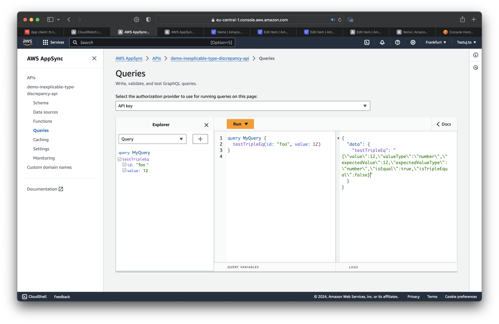

# Reproduction of AS-Script `inexplicable type discrepancy` bug

_Original issue can be found here: [https://github.com/aws/aws-appsync-community/issues](https://github.com/aws/aws-appsync-community/issues)_

## Reproduction steps

1. Clone the repo
  ```bash
  git clone https://github.com/testuj-to/appsync-inexplicable-type-discrepancy.git
  cd appsync-inexplicable-type-discrepancy
  ```
2. Run `make deploy`
3. Send the following query to the API:
  ```graphql
  query Query {
    testTripleEq(id: "foo", value: 12)
  }
  ```
4. See the returned JSON - both `isEqual` and `isTripleEqual` should be `true`, however, only `isEqual` in fact is


